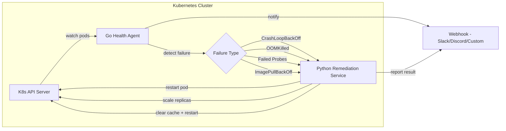

# Infra Autopilot

**A self-healing Kubernetes demo — detect broken pods and fix common problems automatically**

When apps run in **Kubernetes (K8s)**, containers live in **pods**. Pods crash, run out of memory, fail health checks, or can't pull their container image. Many of these failures have known fixes (restart the pod, scale up, clear a cache). This project watches for those patterns and applies fixes without waiting for a human.

Think of it as a tireless operator that handles the boring, repetitive incidents so you can focus on the ones that need judgment.

---

## What you'll learn

| Term | Plain English |
|---|---|
| **Kubernetes (K8s)** | System that runs and restarts containers across machines |
| **Pod** | One or more containers that run together as a unit |
| **CrashLoopBackOff** | Pod keeps crashing; Kubernetes (K8s) backs off between restart attempts |
| **Out Of Memory Killed (OOMKilled)** | Pod killed because it used too much memory |
| **Health probe** | Periodic "are you alive?" check Kubernetes (K8s) runs against your app |
| **ImagePullBackOff** | Can't download the container image (wrong name, registry down) |
| **Remediation** | Automated fix action (restart, scale, etc.) |
| **Informer** | Efficient watcher that listens for pod status changes via the Kubernetes (K8s) API |

---

## The problem in plain English

On-call engineers get paged for the same failures repeatedly: a pod crash-loops, memory spikes, a bad deploy. The fix is often "delete the pod and let Kubernetes (K8s) recreate it" — work a script can do in seconds. This project automates those known fixes and notifies you via webhook (Slack, Discord, etc.) so you still have visibility.

**Goal:** Turn a ~5 minute manual response into ~30 seconds of automated recovery for well-understood failures — reducing **Mean Time To Recovery (MTTR)**.

---

## How it works



**Flow:**

1. **Go Health Agent** watches all pod status via the Kubernetes (K8s) API.
2. When it sees a known failure type, it classifies the event.
3. It sends the event to the **Python Remediation Service** over Hypertext Transfer Protocol (HTTP).
4. The remediation service picks a handler: restart pod, scale deployment, etc.
5. Both detection and fix results go to your **webhook** URL.

Operational details: [docs/runbook.md](docs/runbook.md).

---

## Quick start

```bash
# 1. Create a local Kubernetes (K8s) cluster — Kind (Kubernetes IN Docker) runs K8s inside Docker
make cluster-up

# 2. Build images and deploy agent + remediation service
make deploy

# 3. Deploy a deliberately broken pod and watch auto-fix
make demo

# 4. Tear down
make cluster-down
```

---

## What's inside

| Piece | Technology | What it does |
|---|---|---|
| Health agent | Go, client-go | Watches pods, detects failures |
| Remediation | Python, FastAPI | Runs fix actions via the Kubernetes (K8s) API |
| Local cluster | Kind + Terraform | Creates a disposable Kubernetes (K8s) cluster for learning |
| Manifests | Kubernetes YAML | Deploys services with least-privilege Role-Based Access Control (RBAC) |
| Continuous Integration (CI) | GitHub Actions | Lint, test, build on every push |

---

## Project layout

```
infra-autopilot/
├── agent/                    # Go health monitoring agent
├── remediation/              # Python remediation service + handlers
├── terraform/                # Kind cluster provisioning
├── deploy/manifests/         # Kubernetes YAML
├── docs/runbook.md           # Deploy, extend, troubleshoot
└── Makefile
```

---

## Design choices (for the curious)

| Decision | Why |
|---|---|
| Go for the agent | Handles watching hundreds of pods concurrently with low memory |
| Python for fixes | Easy to add new remediation handlers without recompiling |
| Kind for local dev | Real Kubernetes (K8s) API, runs entirely on your laptop |
| FastAPI for remediation API | Simple Hypertext Transfer Protocol (HTTP) service with auto-generated Application Programming Interface (API) docs |

---

## Ideas for extending this

- Prometheus metrics for fix counts and Mean Time To Recovery (MTTR)
- Policy objects — Custom Resource Definitions (CRDs) — to configure which fixes apply where
- Multi-cluster support
- Built-in chaos tests to validate handlers

---

## License

[MIT](LICENSE) — Copyright 2026 Ethan Francis
